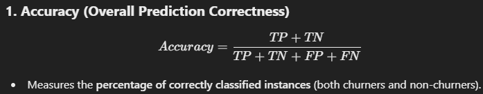
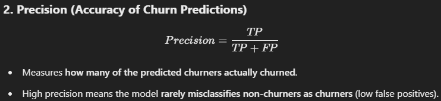
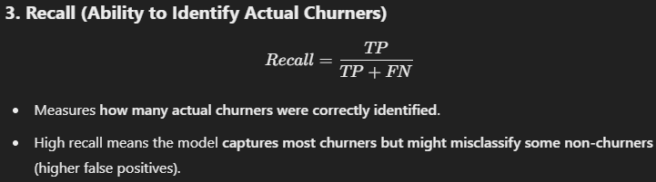
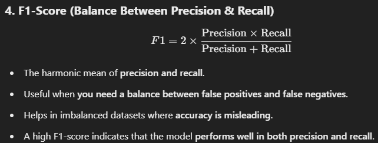

# ML-Classification-Churn-Prediction-project
# 📊 Customer Churn Prediction Project

## 🔍 Project Overview
This project aims to **predict customer churn** in a **telecommunications company** using machine learning. Churn prediction helps identify customers likely to discontinue services, enabling **proactive retention strategies**.

## 📂 Dataset Description
- **Source:** Telco Customer Churn dataset  
- **Features:** Customer demographics, service subscriptions, account information  
- **Target Variable:** **Churn** (Yes/No)  

---

## 🛠 Project Steps

### 1️⃣ Data Preprocessing
- **Loaded and examined** dataset structure.  
- **Handled missing values** in `totalcharges` using **median imputation**.  
- **Converted categorical variables** to numeric:
  - **Binary encoding** for Yes/No features.  
  - **One-hot encoding** for multi-category variables.  
- **Scaled numerical features** (`tenure`, `monthlycharges`, `totalcharges`) using **StandardScaler**.  
- **Removed** `customerid` column.  

---

### 2️⃣ Initial Model Development
Implemented **six models** on original data:

#### 🔹 Logistic Regression (Baseline)
- **Accuracy:** 80.40%  
- **Best performing on imbalanced data**  

#### 🔹 Decision Tree
- **Default:** 72.16%  
- **Tuned:** 77.98% (Optimized using **GridSearchCV**)  

#### 🔹 Random Forest
- **Default:** 77.56%  
- **Tuned:** 79.62% (Improved performance through parameter tuning)  

#### 🔹 XGBoost
- **Default:** 77.13%  
- **Strong baseline performance**  

---

### 3️⃣ Class Imbalance Treatment
- **Applied SMOTE** to balance class distribution.  
- **SMOTE applied before train-test split.**  
- **Maintained the same model architectures.**  

---

### 4️⃣ Post-SMOTE Model Performance
After applying **SMOTE**, model performance improved significantly:

#### 🏆 XGBoost (Default)
- **Accuracy:** 84.93%  
- **Best overall performance**  
- **Balanced precision and recall**  

#### 🌲 Random Forest
- **Default:** 84.88%  
- **Tuned:** 83.96%  
- **Consistent performance across classes**  

#### 📈 Logistic Regression
- **Accuracy:** 81.16%  
- **Improved churn prediction**  

#### 🌳 Decision Tree
- **Default:** 79.03%  
- **Tuned:** 80.77%  
- **Better balanced predictions**  

---

## 📊 Key Performance Metrics
- **Accuracy:** Overall prediction correctness.  
- **Precision:** Accuracy of churn predictions.  
- **Recall:** Ability to identify actual churners.  
- **F1-Score:** Harmonic mean of precision and recall.  

 
 
 
 

---

### 🔎 Summary:
- **SMOTE significantly improved model performance**, especially for churn recall.  
- **XGBoost and Random Forest** emerged as the top-performing models.  
- **Improved class balance** resulted in better overall churn prediction.  
